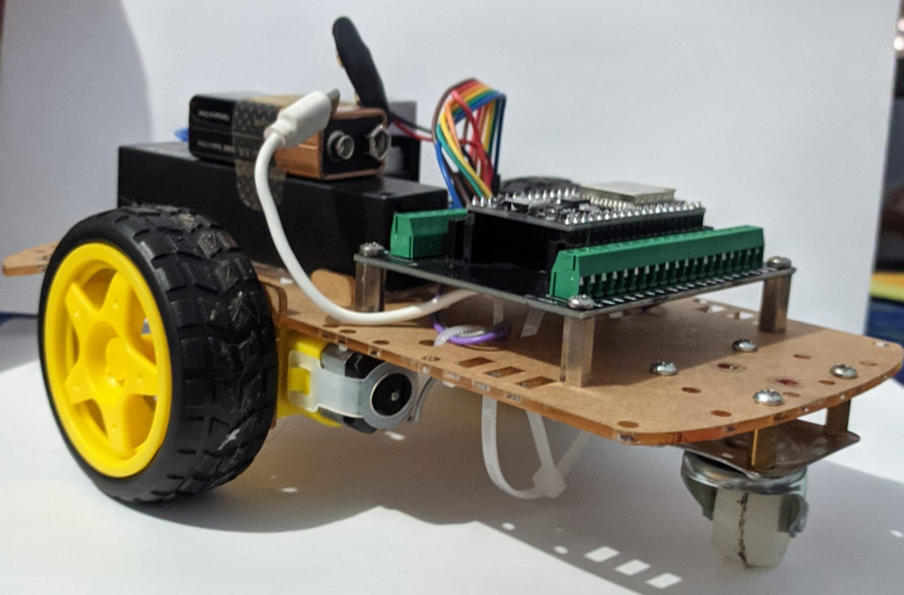
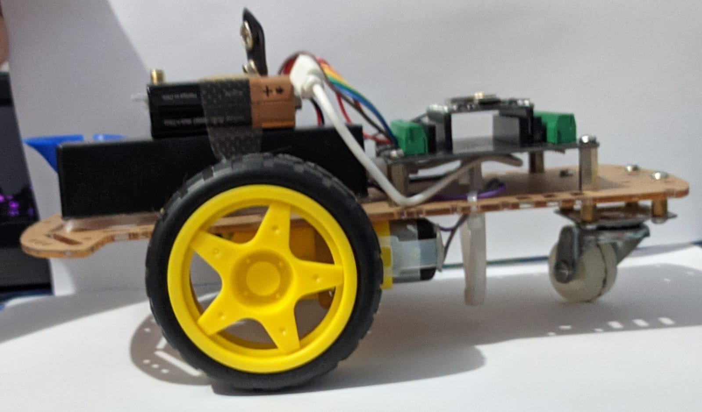
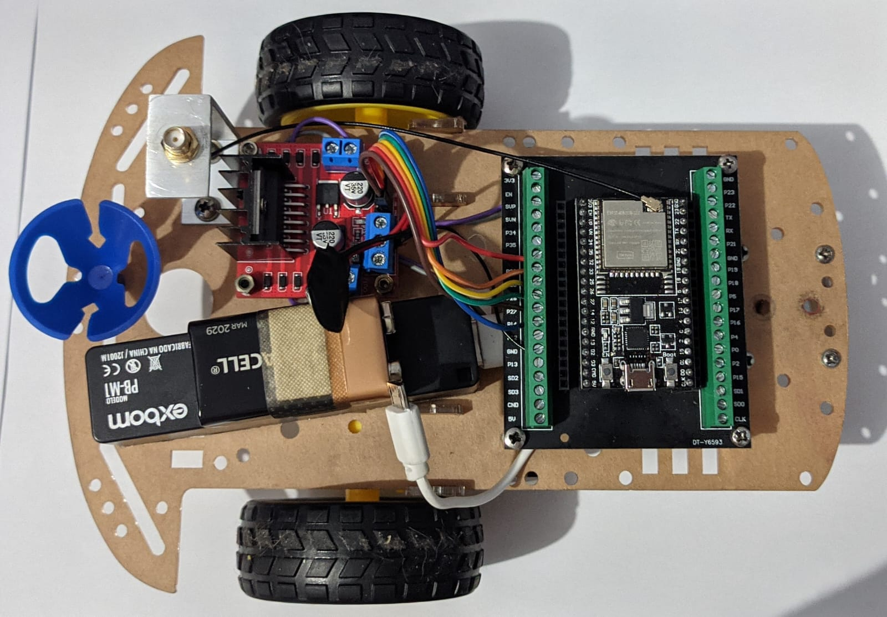
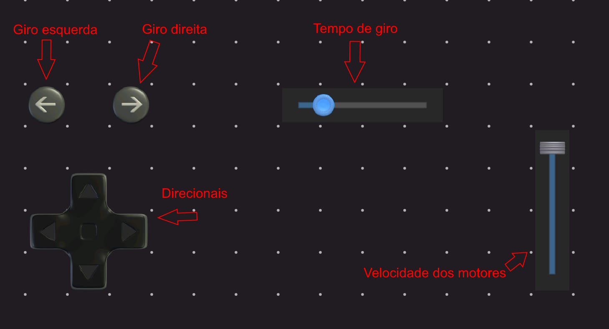

# 🤖 BaloonZord – Robô Bluetooth com ESP32

Este projeto consiste no desenvolvimento de um robô controlado via Bluetooth, criado para uma competição realizada na Faculdade Engenheiro Salvador Arena. Cada robô é equipado com uma agulha na parte frontal e uma bexiga presa à traseira. O objetivo da disputa é que os robôs se enfrentem em uma arena, tentando estourar a bexiga dos adversários enquanto protegem a sua.

## 📱 Funcionalidades

- Controle por comandos Bluetooth via celular
- Movimentos: frente, atrás, esquerda, direita e giro com ângulo ajustável
- Controle da velocidade via comando

## 🎮 Comandos via Bluetooth

| Comando | Descrição                                      |
| ------: | ---------------------------------------------- |
|     `F` | Move para frente                               |
|     `T` | Move para trás                                 |
|     `E` | Gira para a esquerda                 |
|     `D` | Gira para a direita                  |
|     `I` | Gira 90º para a esquerda                       |
|     `O` | Gira 90º para a direita                        |
| `V###;` | Define a velocidade (ex: `V200;`)              |
| `G###;` | Define o tempo de giro 90º em ms (ex: `G120;`) |

> ⚠️ Os comandos `V` e `G` devem terminar com ponto e vírgula `;`

## 🧰 Hardware utilizado

- ESP32
- 2 motores DC
- Ponte H L298N
- Fonte 3V (ESP32)
- Fonte 6V–12V (motores)
- Fios e suporte para bateria
- Opcional: antena externa para melhor alcance Bluetooth

### 🌀 Por que ajustar dinamicamente o tempo de giro?

O giro de 90 graus do robô não é uma operação absolutamente precisa por padrão — ele depende de diversos fatores físicos e mecânicos, como:

- **Distância entre as rodas**
- **Tipo de superfície**
- **Peso e distribuição da carga do robô**
- **Nível de carga da bateria**

Essas variáveis podem mudar de uma arena para outra ou até mesmo durante uma única partida. Por isso, permitir que o tempo de giro seja ajustado dinamicamente via comando Bluetooth proporciona **mais controle e precisão** ao usuário, sem a necessidade de reprogramar o código.

Além disso, o tempo de giro não precisa estar limitado apenas a 90 graus: ao ajustar esse valor, é possível realizar curvas com **ângulos menores ou maiores**, oferecendo uma vantagem estratégica em diferentes situações de combate.

### 🖼️ Imagens

### Vista em perspectiva do robô

  

### Vista lateral

  

### Vista superior

  

### Interface de controle Bluetooth

  

### Disputa Final

